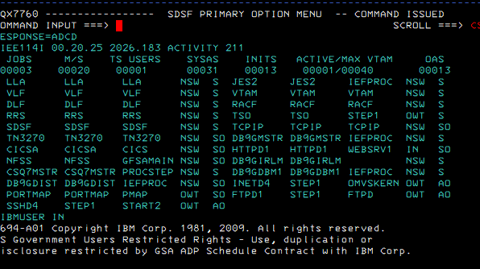
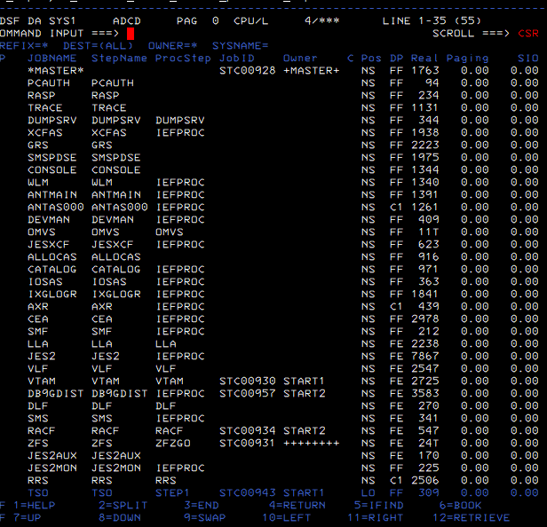
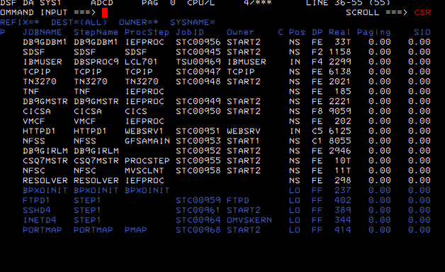
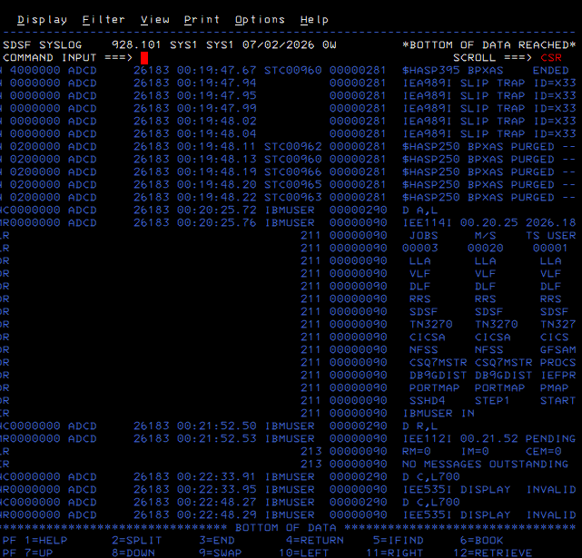
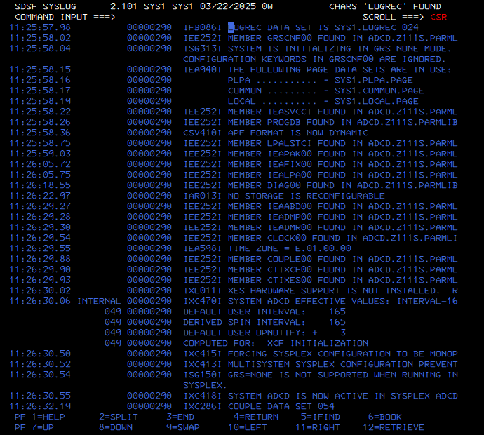

# Clase 1 — Operación básica y lectura inicial del sistema

## Objetivo

Aprender a leer el sistema z/OS desde SDSF sin tocar configuración.

## Qué hicimos

- Entramos en TSO/ISPF con IBMUSER.
- Abrimos SDSF.
- Ejecutamos `/D A,L`.
- Entramos al panel `DA`.
- Identificamos address spaces activos.
- Entramos al SYSLOG con `LOG`.
- Buscamos mensajes de LOGREC.

## Descubrimientos

Identificamos los conceptos:

- `STC` = Started Task
- `TSU` = sesión TSO interactiva
- `JOB` = trabajo batch

Servicios observados:

- JES2
- RACF
- VTAM
- TCPIP
- TN3270
- CICS
- DB2
- SSHD
- FTPD
- PORTMAP
- IBMUSER

## Evidencias

## Conclusión

La primera fase consistió en aprender a mirar el sistema antes de modificar nada. SDSF permite observar procesos, servicios y mensajes del sistema.
