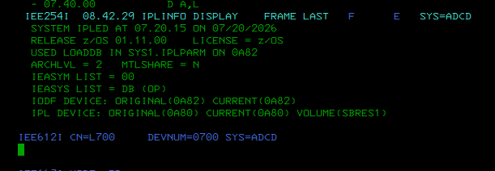
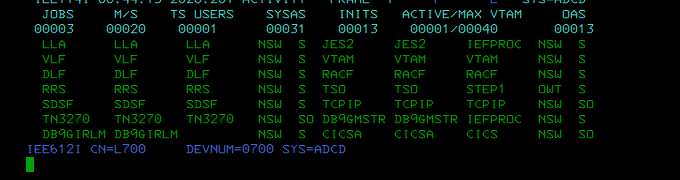
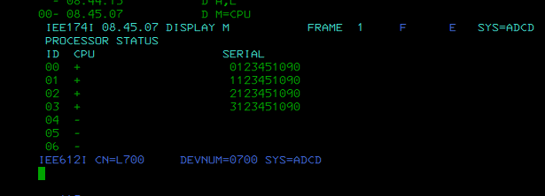
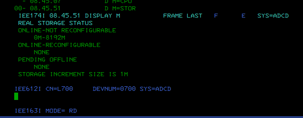
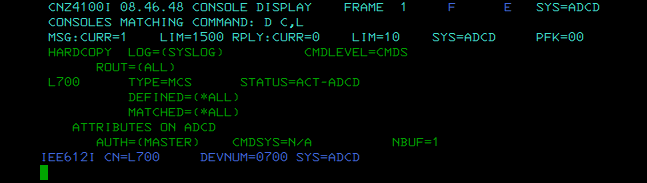
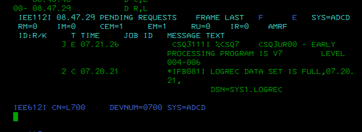

# LAB01 - z/OS System Introduction

## Course alignment

**IBM Course:** DL00EZ20IG - z/OS System Services Structure  
**Unit:** UNIT 1 - z/OS system introduction

Related course sections:

- 1:1 - Introduction
- 1:2 - z/Architecture Overview
- 1:3 - Z System Processors
- 1:4 - z/OS

## Objective

Identify a running ADCD z/OS system, verify how it was IPLed, observe the active system address spaces, display logical processors, review online real storage, and confirm the basic console and pending-message status.

This lab uses only non-destructive operator display commands.

## Environment

| Item | Value observed |
|---|---|
| Platform | ADCD z/OS on Hercules |
| System name | ADCD |
| z/OS release | 01.11.00 |
| Console | L700 |
| Access method | 3270 / MCS console / SDSF |
| IPL device | 0A80 |
| IPL volume | SBRES1 |

## Commands executed

From SDSF, operator commands were issued with `/`:

```text
/D IPLINFO
/D A,L
/D M=CPU
/D M=STOR
/D C,L
/D R,L
```

From the master console, the equivalent commands are:

```text
D IPLINFO
D A,L
D M=CPU
D M=STOR
D C,L
D R,L
```

---

## 1. IPL information

Command:

```text
D IPLINFO
```

Evidence:



Key observations:

```text
SYSTEM IPLED AT 07.20.15 ON 07/20/2026
RELEASE z/OS 01.11.00
USED LOADDB IN SYS1.IPLPARM ON 0A82
IEASYM LIST = 00
IEASYS LIST = DB (OP)
IODF DEVICE: ORIGINAL(0A82) CURRENT(0A82)
IPL DEVICE: ORIGINAL(0A80) CURRENT(0A80) VOLUME(SBRES1)
SYS=ADCD
```

Interpretation:

The system is ADCD running z/OS 1.11. It was IPLed from device `0A80`, volume `SBRES1`. The system used `SYS1.IPLPARM` from `0A82`, with `IEASYSDB` and `IEASYM00` as initialization references.

---

## 2. Active address spaces

Command:

```text
D A,L
```

Evidence:



Visible address spaces include:

```text
LLA
JES2
VLF
VTAM
DLF
RACF
TSO
SDSF
TCPIP
TN3270
DB9GIRLM
CICSA
```

Interpretation:

The system has the main runtime components active: JES2 for batch/spool, RACF for security, VTAM/TCPIP/TN3270 for communications, TSO/SDSF for interactive and operator work, and application subsystems such as CICS and Db2 IRLM.

---

## 3. Processor status

Command:

```text
D M=CPU
```

Evidence:



Observed logical processors:

```text
00
01
02
03
```

Interpretation:

z/OS sees multiple logical processors. In this Hercules/ADCD environment, these values are used as lab evidence of the logical CPU view presented to z/OS, not as real production hardware inventory.

---

## 4. Real storage

Command:

```text
D M=STOR
```

Evidence:



Observed storage status:

```text
REAL STORAGE STATUS
ONLINE-NOT RECONFIGURABLE
0M-4095M
ONLINE-RECONFIGURABLE
NONE
PENDING OFFLINE
NONE
STORAGE INCREMENT SIZE IS 1M
```

Interpretation:

The system has approximately 4 GB of online real storage. No storage is pending offline, and no online-reconfigurable storage is shown.

---

## 5. Console status

Command:

```text
D C,L
```

Evidence:



Key observations:

```text
L700 TYPE=MCS STATUS=ACT-ADCD
HARDCOPY LOG=(SYSLOG)
MSG:CURR=1 LIM=1500
RPY:CURR=0 LIM=10
```

Interpretation:

Console `L700` is active as an MCS console for system `ADCD`. The hardcopy log is `SYSLOG`. There are no pending replies requiring operator response.

---

## 6. Pending requests and visible action messages

Command:

```text
D R,L
```

Evidence:



Key observations:

```text
RM=0
IM=0
CEM=1
EM=1
RU=0
IR=0

CSQ3111I *CSQ7 CSQ3UR00 - EARLY PROCESSING PROGRAM IS V7 LEVEL 004-006
*IFB081I LOGREC DATA SET IS FULL DSN=SYS1.LOGREC
```

Interpretation:

There is no real WTOR/reply pending. `RM=0` confirms that no reply message is waiting for an operator response. The important operational finding is that `SYS1.LOGREC` is full.

This should be documented as a maintenance finding, not answered with a `R xx,...` reply.

---

## Main finding

```text
IFB081I LOGREC DATA SET IS FULL
DSN=SYS1.LOGREC
```

Operational meaning:

`SYS1.LOGREC` stores problem summary records for hardware and software errors. If it is full, the system can continue running, but new diagnostic records may not be recorded correctly until maintenance is performed.

Safe operator action at this stage:

```text
Document the condition.
Do not delete SYS1.LOGREC.
Do not initialize SYS1.LOGREC without a procedure.
Do not issue a reply; no reply is pending.
```

---

## Conclusion

This lab validates the basic runtime identity of the ADCD z/OS system. It confirms IPL information, active address spaces, logical processors, central storage, active console status, and pending system messages.

The system is running normally for the purposes of this lab. The main documented maintenance item is that `SYS1.LOGREC` is full.

