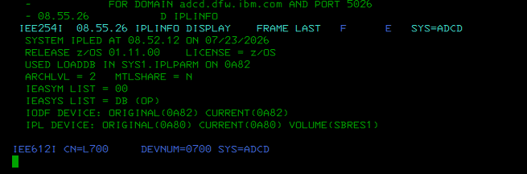
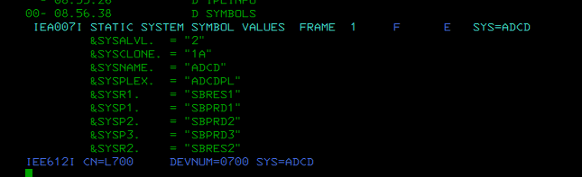
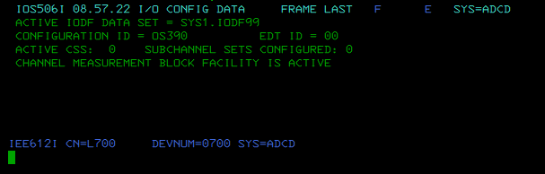
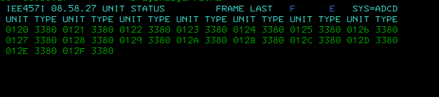
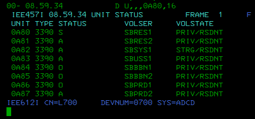
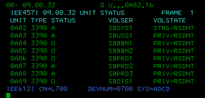
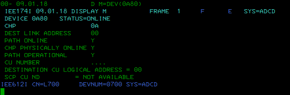
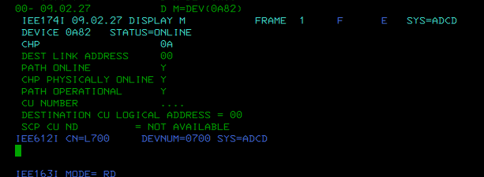
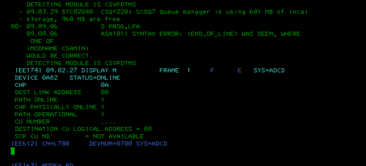
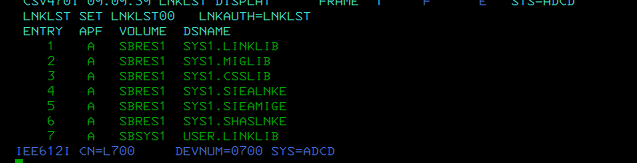

# LAB02 - z/OS System Services Structure: Operating Environment Initialization

## Course alignment

IBM Course: **DL00EZ20IG - z/OS System Services Structure**  
Unit: **UNIT 2 - Operating environment initialization**

Related sections:

- 2:1 - Initialization Data Sets
- 2:2 - I/O Config and Parmlib
- 2:3 - The Nucleus Initialization Program
- 2:4 - LOADXX and Parameters
- 2:5 - Link Pack Area and Address Spaces

## Objective

Validate how the ADCD z/OS system was initialized by collecting non-destructive operator evidence about IPL information, system symbols, the active I/O configuration, DASD status, device paths, and the active LINKLIST.

This lab turns the theoretical initialization flow from the course into practical evidence collected from a real ADCD/Hercules environment.

## Environment

- Platform: ADCD z/OS on Hercules
- System name: ADCD
- z/OS release observed: 01.11.00
- Console: L700
- Access method: 3270 / SDSF / MCS console

## Commands executed

SDSF/operator command format:

```text
/D IPLINFO
/D SYMBOLS
/D IOS,CONFIG
/D U,DASD,OFFLINE
/D U,,,0A80,16
/D U,,,0A82,16
/D M=DEV(0A80)
/D M=DEV(0A82)
/D PROG,LPA
/D PROG,LNKLST
```

The same commands can be issued from the master console without the leading slash.

## Evidence and findings

### 1. IPL information

Command:

```text
D IPLINFO
```

Evidence:



Observed findings:

```text
System: ADCD
z/OS release: 01.11.00
IPL device: 0A80
IPL volume: SBRES1
SYS1.IPLPARM used from: 0A82
IEASYS list: DB
IEASYM list: 00
IODF device: 0A82
```

Interpretation:

The system was IPLed as ADCD from device `0A80`, volume `SBRES1`. The initialization process used `SYS1.IPLPARM` from `0A82`, with `IEASYSDB` and `IEASYM00` active.

---

### 2. System symbols

Command:

```text
D SYMBOLS
```

Evidence:



Observed examples:

```text
&SYSNAME = "ADCD"
&SYSCLONE = "1A"
&SYSPLEX = "ADCDPL"
&SYSR1 = "SBRES1"
&SYSR2 = "SBRES2"
```

Interpretation:

System symbols are used by z/OS to resolve names and parameters during initialization. They are closely related to PARMLIB/IPLPARM configuration and system tailoring.

---

### 3. Active I/O configuration

Command:

```text
D IOS,CONFIG
```

Evidence:



Observed findings:

```text
ACTIVE IODF DATA SET = SYS1.IODF09
CONFIGURATION ID = OS390
EDT ID = 00
ACTIVE CSS: 0
SUBCHANNEL SETS CONFIGURED: 0
CHANNEL MEASUREMENT BLOCK FACILITY IS ACTIVE
```

Interpretation:

The active I/O definition is `SYS1.IODF09`. This IODF defines the hardware I/O configuration visible to z/OS, including devices, control units, channels, and EDT information.

---

### 4. Offline DASD devices

Command:

```text
D U,DASD,OFFLINE
```

Evidence:



Observed findings:

Several `3380` devices are defined but offline, including units in the `0120` range.

Interpretation:

Defined but offline devices are not automatically an error in this ADCD/Hercules lab. They are documented as part of the visible I/O configuration and are not varied online in this lab.

---

### 5. DASD range around IPL device 0A80

Command:

```text
D U,,,0A80,16
```

Evidence:



Observed findings:

```text
0A80 3390 SBRES1
0A81 3390 SBRES2
0A82 3390 SBSYS1
0A83 3390 SBUSS1
0A84 3390 SBBBN1
0A85 3390 SBBBN2
0A86 3390 SBPRD1
0A87 3390 SBPRD2
```

Interpretation:

The display maps important ADCD DASD volumes. `0A80/SBRES1` is the IPL/SYSRES volume. `0A82/SBSYS1` is important for initialization because it contains `SYS1.IPLPARM` according to `D IPLINFO`.

---

### 6. DASD range around 0A82

Command:

```text
D U,,,0A82,16
```

Evidence:



Observed findings:

```text
0A82 3390 SBSYS1
0A83 3390 SBUSS1
0A84 3390 SBBBN1
0A85 3390 SBBBN2
0A86 3390 SBPRD1
0A87 3390 SBPRD2
0A88 3390 SBPRD3
0A89 3390 SBDIS1
```

Interpretation:

This confirms additional ADCD volumes available to the system and extends the initialization device map around `0A82`.

---

### 7. Device path status for 0A80

Command:

```text
D M=DEV(0A80)
```

Evidence:



Observed findings:

```text
DEVICE 0A80 STATUS=ONLINE
PATH ONLINE Y
CHP PHYSICALLY ONLINE Y
PATH OPERATIONAL Y
```

Interpretation:

The IPL device is online and its path is operational. This validates that the SYSRES device is correctly available to z/OS.

---

### 8. Device path status for 0A82

Command:

```text
D M=DEV(0A82)
```

Evidence:



Observed findings:

```text
DEVICE 0A82 STATUS=ONLINE
PATH ONLINE Y
CHP PHYSICALLY ONLINE Y
PATH OPERATIONAL Y
```

Interpretation:

The device used for `SYS1.IPLPARM`/IODF-related initialization evidence is online and has an operational I/O path.

---

### 9. LPA display attempt

Command:

```text
D PROG,LPA
```

Evidence:



Observed finding:

The command was attempted, but the system returned a syntax-related response in this environment.

Interpretation:

This is kept as evidence of an operator learning point. It is not used as a positive LPA finding. The valid positive program-management evidence for this lab is the LINKLIST display below.

---

### 10. Active LINKLIST

Command:

```text
D PROG,LNKLST
```

Evidence:



Observed findings:

```text
LNKLST SET LNKLST00
LNKAUTH=LNKLST
SYS1.LINKLIB
SYS1.MIGLIB
SYS1.CSSLIB
SYS1.SIEALNKE
SYS1.SIEAMIGE
SYS1.SHASLNKE
USER.LINKLIB
```

Interpretation:

The active LINKLIST set is `LNKLST00`. LINKLIST libraries are part of the system module search path used by z/OS to locate executable modules.

## Conclusion

This lab validates the operating environment initialization of the ADCD z/OS system. The evidence confirms the IPL device and SYSRES volume, the active system parameter suffixes, system symbols, the active IODF, DASD online/offline visibility, operational I/O paths for initialization-related devices, and the active LINKLIST.

Main findings:

```text
ADCD z/OS 1.11 IPLed from 0A80 / SBRES1.
SYS1.IPLPARM was used from 0A82.
IEASYSDB and IEASYM00 were active during initialization.
The active IODF is SYS1.IODF09.
Devices 0A80 and 0A82 are online with operational paths.
Several 3380 devices are defined but offline.
The active LINKLIST set is LNKLST00.
```

No destructive or modifying commands were used.
