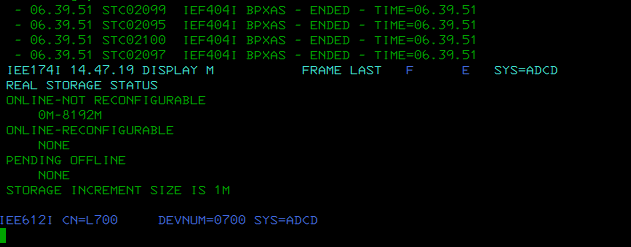
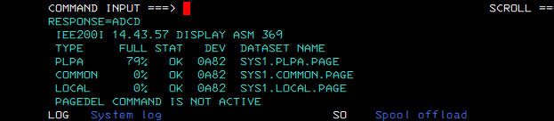
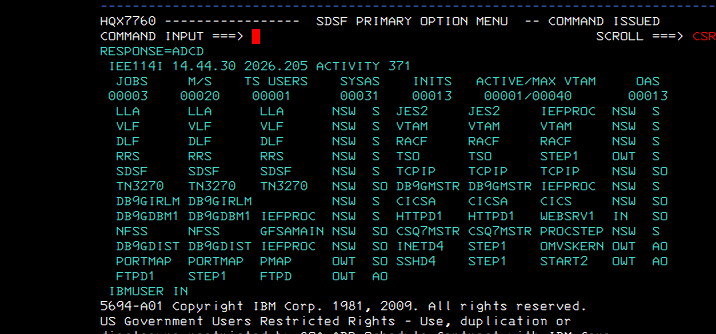
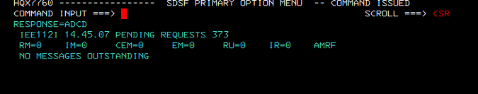
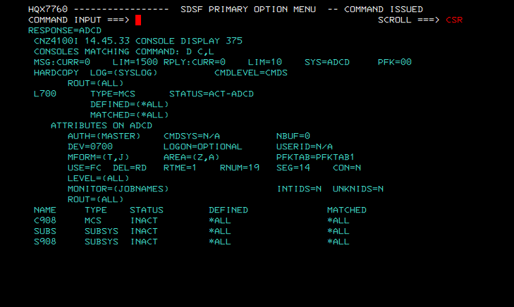
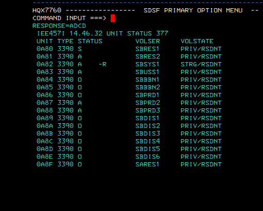

# LAB04 - z/OS System Services Structure: Storage Management

## Course alignment

IBM Course: **DL00EZ20IG - z/OS System Services Structure**  
Unit: **Storage Management / Virtual Storage / Auxiliary Storage**

This lab maps z/OS storage management concepts to a running ADCD/Hercules system using non-destructive operator display commands.

## Objective

Validate how the system reports:

- Real storage
- Auxiliary storage
- Page datasets
- Active address spaces
- Console status
- Pending messages
- DASD volumes supporting the environment

## Environment

- Platform: ADCD z/OS on Hercules
- System name: ADCD
- Console: L700
- Access method: 3270 / SDSF / MCS console
- Method: read-only operator commands

## Commands executed

```text
/D M=STOR
/D ASM
/D A,L
/D R,L
/D C,L
/D U,,,0A80,16
```

## Evidence

| Evidence | Command | Purpose |
|---|---|---|
| `01_d_m_stor.png` | `D M=STOR` | Display real storage status |
| `02_d_asm.png` | `D ASM` | Display Auxiliary Storage Manager and page datasets |
| `03_d_a_l.png` | `D A,L` | Display active address spaces |
| `04_d_r_l.png` | `D R,L` | Display pending requests/messages |
| `05_d_c_l.png` | `D C,L` | Display console status |
| `06_d_u_0a80_16.png` | `D U,,,0A80,16` | Display DASD volumes around the IPL device |

## Findings

### Real storage

The system reports real storage online from `0M` to `8192M`:

```text
REAL STORAGE STATUS
ONLINE-NOT RECONFIGURABLE
0M-8192M

ONLINE-RECONFIGURABLE
NONE

PENDING OFFLINE
NONE

STORAGE INCREMENT SIZE IS 1M
```

This confirms that the ADCD system has approximately 8 GB of real storage online and no pending offline storage condition.



### Auxiliary storage and paging datasets

The `D ASM` output shows active page datasets on device `0A82`:

```text
TYPE     FULL  STAT  DEV   DATASET NAME
PLPA     79%   OK    0A82  SYS1.PLPA.PAGE
COMMON   0%    OK    0A82  SYS1.COMMON.PAGE
LOCAL    0%    OK    0A82  SYS1.LOCAL.PAGE
```

The key operational point is that Auxiliary Storage Manager is active and the page datasets are in `OK` status.



### Active address spaces

The system displays multiple active address spaces, including system services and workload components such as:

```text
LLA
VLF
DLF
JES2
VTAM
RACF
TSO
TCPIP
TN3270
DB9GMSTR
DB9GIRLM
DB9GDBM1
DB9GDIST
CICSA
HTTPD1
CSQ7MSTR
SSHD4
FTPD1
IBMUSER
```

This connects the storage view to the real address spaces using system resources.



### Pending requests and messages

The system reports no outstanding messages:

```text
RM=0 IM=0 CEM=0 EM=0 RU=0 IR=0
NO MESSAGES OUTSTANDING
```

This means there were no operator replies pending at the time of the lab.



### Console status

Console `L700` is active as an MCS console with `MASTER` authority and `SYSLOG` as hardcopy log:

```text
L700 TYPE=MCS STATUS=ACT-ADCD
AUTH=(MASTER)
HARDCOPY LOG=(SYSLOG)
```



### DASD volumes

The DASD range around `0A80` shows key ADCD volumes online, including:

```text
0A80  SBRES1
0A81  SBRES2
0A82  SBSYS1
0A83  SBUSS1
0A84  SBBBN1
0A85  SBBBN2
0A86  SBPRD1
0A87  SBPRD2
0A88  SBPRD3
0A89  SBDIS1
0A8A  SBDIS2
0A8B  SBDIS3
0A8C  SBDIS4
0A8D  SBDIS5
0A8E  SBDIS6
0A8F  SARES1
```

The important relation for this lab is that device `0A82` backs the page datasets shown in `D ASM`.



## Operational notes

Only display commands were used. No storage, page dataset, console, DASD, or system configuration changes were made.

Commands intentionally avoided:

```text
SETASM
VARY
CONFIG
ACTIVATE
CHNGDUMP
DUMPDS
CANCEL
FORCE
```

## Conclusion

This lab validates the storage management layer of the ADCD z/OS system. It confirms online real storage, active auxiliary storage, valid page datasets, address spaces consuming system resources, console status, DASD backing volumes, and the absence of pending operator replies.

The main technical findings are:

```text
Real storage online: 0M-8192M
Page datasets on 0A82: SYS1.PLPA.PAGE, SYS1.COMMON.PAGE, SYS1.LOCAL.PAGE
ASM page dataset status: OK
Pending operator replies: none
Console L700: active
```
