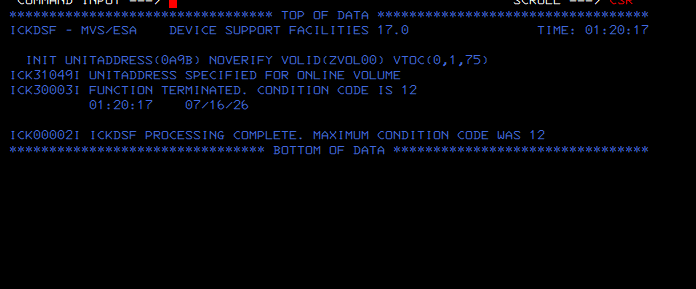
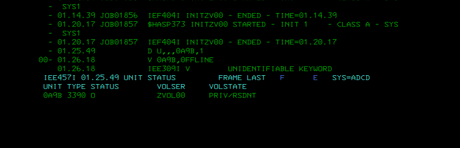
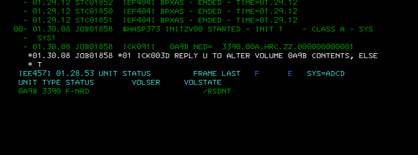
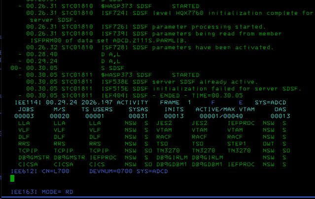

# Lab 04 - ZVOL DASD Engineering

## Objetivo

Reparar y habilitar dos volúmenes DASD de laboratorio:

```text
0A9B -> ZVOL00
0A9C -> ZVOL01
```

## Situación inicial

Los volúmenes aparecían definidos y visibles, pero al entrar desde ISPF 3.4 daban:

```text
VTOC error
```

Además existían shadows antiguos y los ficheros originales eran anómalos para un uso real.

## Trabajo realizado

1. Apagado limpio de z/OS.
2. Backup de CCKD/shadows antiguos.
3. Creación de nuevos volúmenes 3390-3 con `dasdinit`.
4. Retirada de shadows antiguos.
5. IPL de z/OS.
6. Intento inicial de `ICKDSF INIT`, que falló porque el volumen estaba online.
7. `VARY 0A9B,OFFLINE` / `VARY 0A9C,OFFLINE`.
8. Inicialización VTOC con ICKDSF.
9. Confirmación `R xx,U`.
10. Vuelta online de los volúmenes.

## Evidencias visuales






## Resultado

Los ZVOL quedan preparados como espacio DASD propio para laboratorio mainframe.

## Valor técnico

Este lab demuestra:

- diagnóstico de `VTOC error`;
- manejo de imágenes DASD Hercules;
- control de shadows;
- inicialización de VTOC con ICKDSF;
- uso de `VARY ONLINE/OFFLINE`;
- operación segura de volúmenes no críticos.
