# Lab 05 - DB2 + CICS DB2CONN Integration

## Objetivo

Dejar CICS `CICSA` conectado a DB2 `DB9G` mediante `DB2CONN`.

## Situación inicial

CICS tenía activado:

```text
DB2CONN=YES
```

pero fallaba la conexión:

```text
DFHSI8440 CICS Initiating connection to DB2.
DFHSI8442 CICS Connection to DB2 has failed.
```

## Trabajo realizado

1. Verificación de región CICS activa.
2. Verificación de DB2 activo por address spaces:
   - `DB9GMSTR`
   - `DB9GIRLM`
   - `DB9GDBM1`
   - `DB9GDIST`
3. Revisión de `STEPLIB` de `CICSA`.
4. Añadido de `DSN910.DB9G.SDSNEXIT` antes de `DSN910.SDSNLOAD`.
5. Entrada a terminal CICS.
6. Creación de `DB2CONN(CICSDB2)` en `GROUP(ALL4)`.
7. Instalación directa de `DB2CONN`.
8. Comprobación con `CEMT I DB2CONN`.
9. Resultado `CONNECTED`.
10. Persistencia añadiendo `ALL4` a `XYZLIST`.

## Evidencias visuales

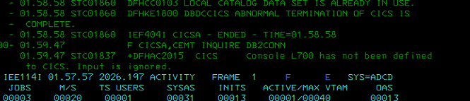
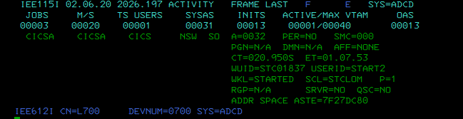
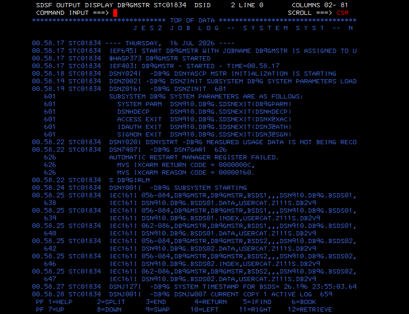
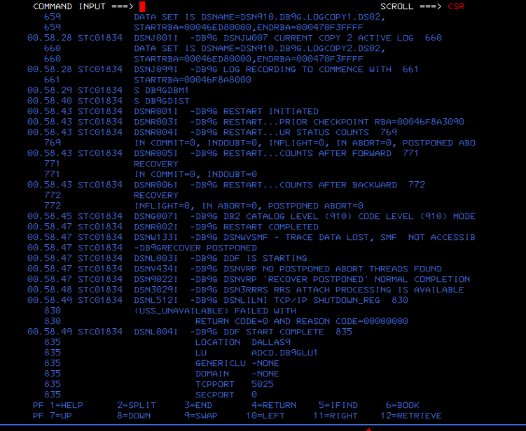
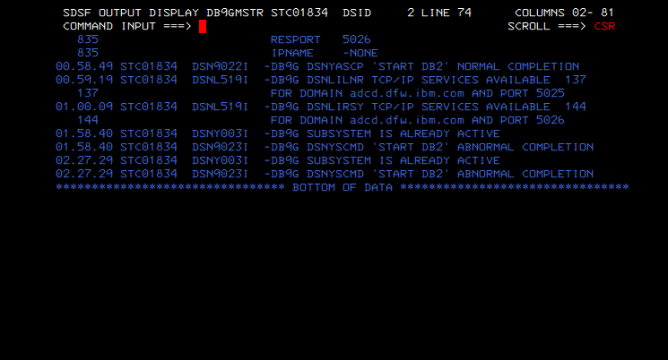
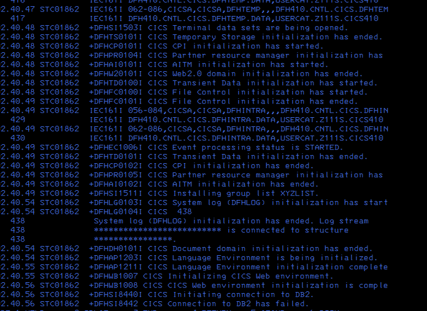
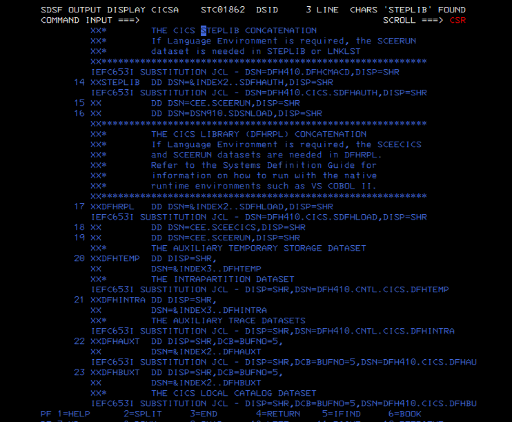
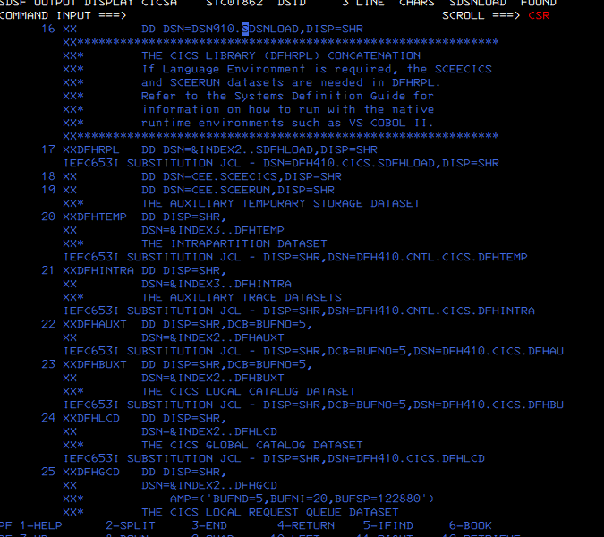
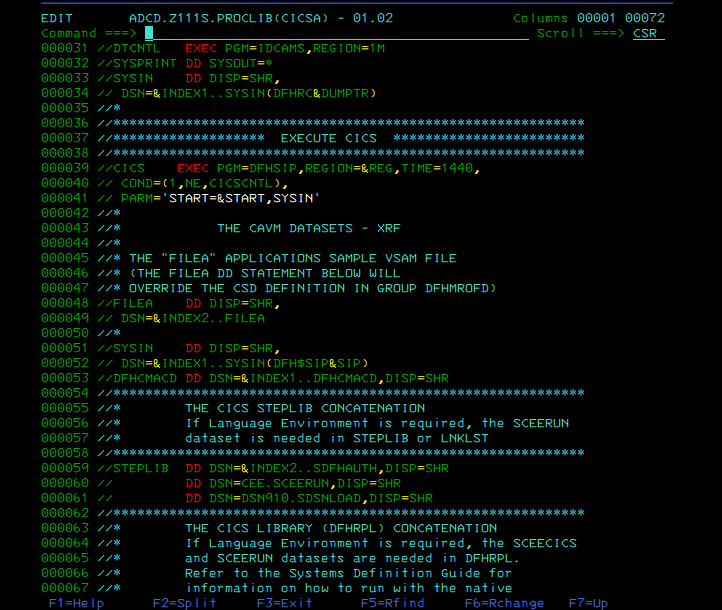
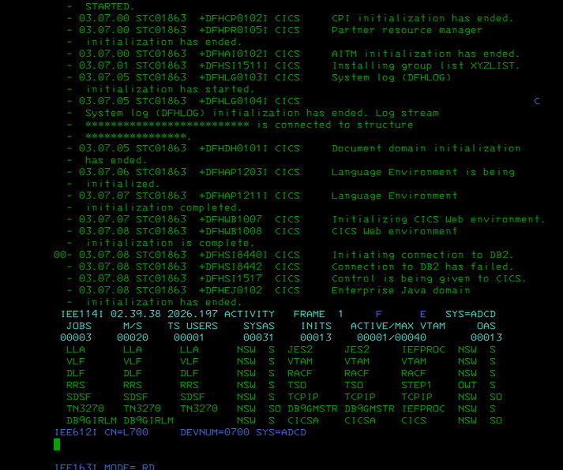
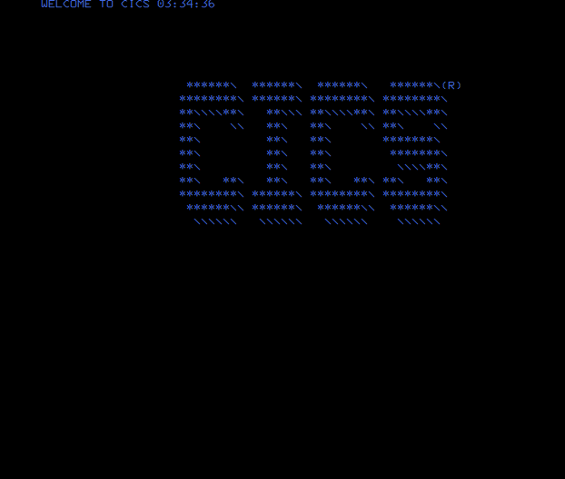
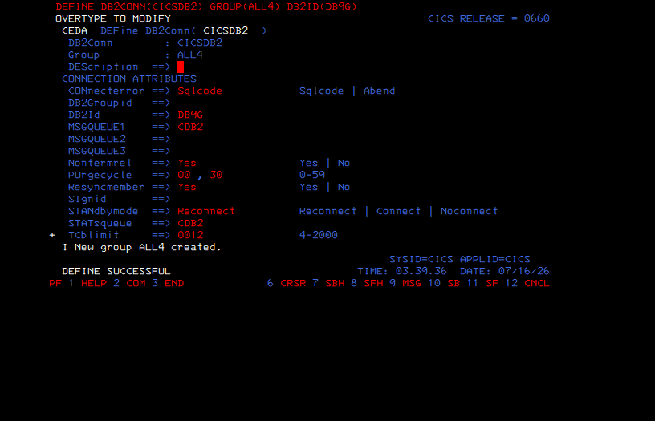
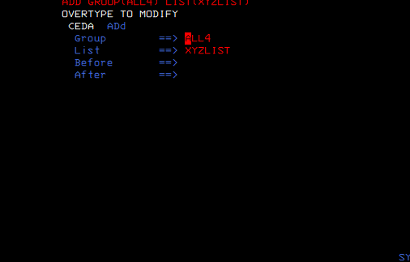
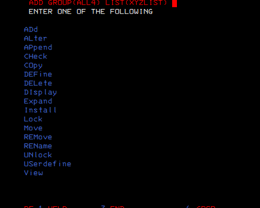
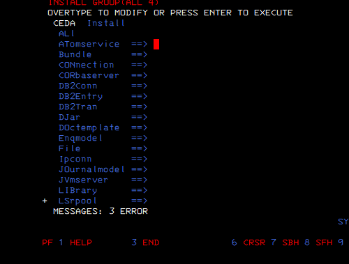
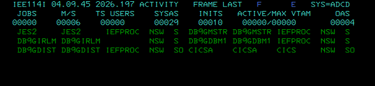

## Resultado final

```text
DB2 DB9G activo
CICS CICSA activo
DB2CONN(CICSDB2) definido
DB2ID(DB9G)
DB2CONN instalado
CICS conectado a DB2
ALL4 añadido a XYZLIST
```

## Valor técnico

Este lab demuestra:

- diagnóstico de conexión CICS-DB2;
- lectura de logs CICS en SDSF;
- diferenciación entre subsystem ID y address spaces DB2;
- ajuste de `STEPLIB`;
- uso de CEDA y CEMT;
- instalación online de recursos CICS;
- persistencia CSD mediante listas/grupos.
