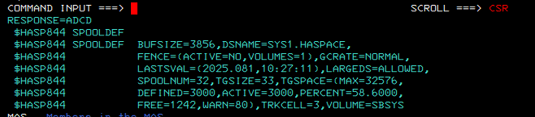
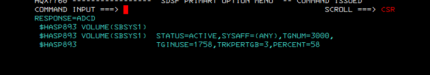
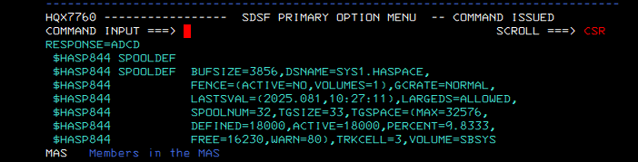

# Lab 10 - JES2 SPOOL expansion with a new Hercules DASD volume

## Purpose

This lab expands the JES2 spool capacity of the ADCD z/OS 1.11 system running on Hercules by adding a new 3390 DASD volume named `SBSYS9` and starting it as a JES2 SPOOL volume.

The goal was not to change the JES2 parameter prefix, nor to perform a cold start. The goal was to add capacity safely using the existing JES2 `SPOOLDEF` convention:

```text
DSNAME=SYS1.HASPACE
VOLUME=SBSYS
```

Because the active SPOOL configuration already used the `SBSYS` prefix, the new volume was named `SBSYS9`.

## Initial state

Evidence showed one active JES2 spool volume only:

```text
VOLUME(SBSYS1) STATUS=ACTIVE
TGNUM=3000
TGINUSE=1758 / 1764 approx.
PERCENT=58
```

`$D SPOOLDEF` showed:

```text
TGSPACE=(MAX=32576,DEFINED=3000,ACTIVE=3000,PERCENT=58.600,FREE=1242,WARN=80)
DSNAME=SYS1.HASPACE
VOLUME=SBSYS
```





## Implementation summary

1. Verified that `0A9D` was available as a DASD device.
2. Created a new Hercules CCKD file `SBSYS9.CCKD` as a 3390-3 volume.
3. Attached the CCKD file to device `0A9D`.
4. Initialized the volume with ICKDSF and created the VTOC/index.
5. Allocated `SYS1.HASPACE` on `SBSYS9` with `RECFM=U` and `BLKSIZE=3856`.
6. Started the new spool volume dynamically with JES2 command `$S SPOOL(SBSYS9)`.
7. Verified the final JES2 SPOOL capacity increase.
8. Persisted the Hercules configuration by adding `0A9D 3390 F:	echlab
edacted-path-or-equivalent.cCKD` to `hercules.cnf`.

## Final state

Final `$D SPOOLDEF` showed:

```text
TGSPACE=(MAX=32576,
DEFINED=18000,
ACTIVE=18000,
PERCENT=9.8333,
FREE=16230,
WARN=80)
```

That means JES2 SPOOL capacity increased from `3000` to `18000` track groups, and utilization dropped from about `58%` to about `9.8%`.



## Key result

| Metric | Before | After |
|---|---:|---:|
| Active SPOOL track groups | 3000 | 18000 |
| Free track groups | 1242 | 16230 |
| SPOOL utilization | ~58.6% | ~9.8% |
| Active SPOOL volumes | SBSYS1 | SBSYS1 + SBSYS9 |

## Why this matters

A growing JES2 spool can stop job submission, logging, output queues and general batch operations. This lab demonstrates a practical systems-programming task: identify a spool-capacity risk, add DASD-backed JES2 spool capacity, verify the result, and persist the emulator configuration.

## Files in this lab

```text
commands/
  01-windows-create-dasd.md
  02-zos-operator-commands.md
  03-hercules-persistence.ps1
jcl/
  INISPL9.jcl
  ALCSPL9_TSO_ALLOC.jcl
notes/
  troubleshooting.md
  findings.md
evidence/
  screenshots/
  source-docs/
```

## Safety notes

- Do not use `SBSYS2`; it already exists as a system volume in this ADCD layout.
- Do not stop or remove the active `SBSYS1` spool volume.
- Do not cold start JES2 for this lab.
- Do not delete `SYS1.HASPACE` once JES2 has started using the volume.
- Treat `SYS1.LOGREC` full as a separate maintenance issue, not as part of the spool expansion.
