# Guided Evidence — JES2 Spool Expansion on SBSYS9

[← Lab lesson](../README.md) · [Academy](https://github.com/P-dot/P-dot/blob/main/docs/ACADEMY.md)

This evidence tells one capacity-engineering story: **measure JES2 spool pressure, provision a new DASD-backed spool resource, validate it at each layer, and prove the resulting capacity change**.

## Architecture

    JES2 jobs / SYSOUT
           |
           v
      JES2 spool
           |
       SYS1.HASPACE
           |
       +---+---+
       |       |
     SBSYS1  SBSYS9
               |
          3390 @ 0A9D
               |
        Hercules CCKD

The important lesson is the boundary between layers. Creating a CCKD file does not make it JES2 spool. Attaching a device does not initialize a z/OS volume. Initializing a volume does not allocate HASPACE. Each transition needs separate evidence.

### 01–02 — establish the capacity baseline

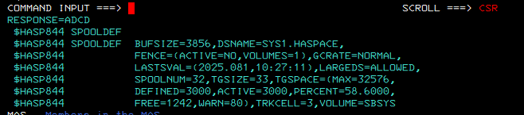

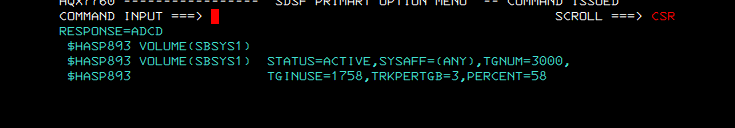

**Observe:** SPOOLDEF reports 3000 active track groups with usage around 58%, and the volume display shows SBSYS1 as the active spool volume.

**Interpret:** this is the before-state. Without it, a later percentage change would have no defensible baseline.

### 03 — identify a candidate device

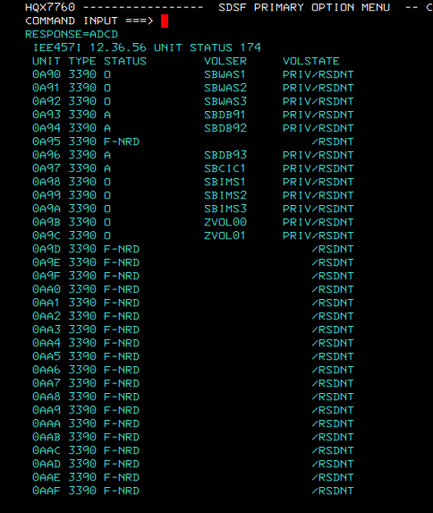

**Observe:** device 0A9D appears as a 3390 device in a non-ready/free state.

**Interpret:** the address is available to receive the new emulated DASD resource. This proves device-slot availability, not storage readiness.

### 04–05 — create and attach the emulated DASD

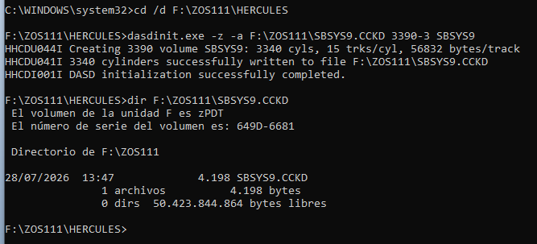

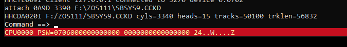

**Observe:** Hercules dasdinit creates SBSYS9.CCKD as a 3390 model and Hercules attaches that backing file to 0A9D.

**Interpret:** the host/emulator layer now presents a DASD device to the guest. z/OS still needs a usable volume structure.

### 06–08 — initialize the z/OS volume

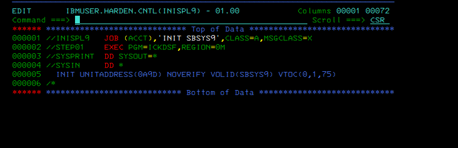

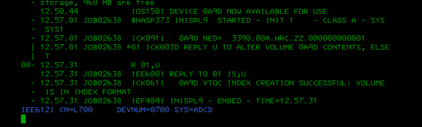

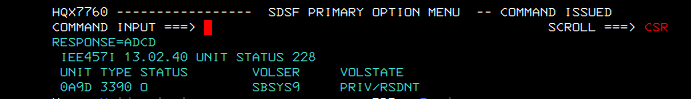

**Observe:** ICKDSF INIT targets 0A9D with VOLSER SBSYS9 and requests a VTOC. The console reports VTOC index creation successful; a later unit display shows 0A9D online with SBSYS9.

**Interpret:** the device has crossed the next boundary: emulated disk → initialized z/OS volume → online storage resource.

**Why the VTOC matters:** z/OS needs volume metadata describing data-set extents. A raw 3390 image alone is not a usable z/OS data-set volume.

### 09–10 — create the JES2 spool data set

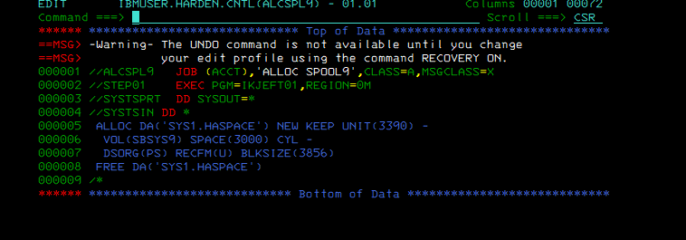

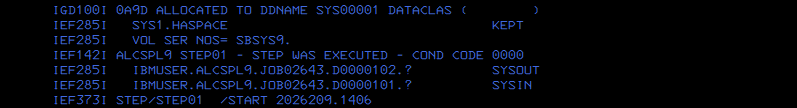

**Observe:** the allocation requests SYS1.HASPACE on SBSYS9 with a defined space quantity and spool-compatible data-set characteristics. The step completes CC 0000 and the volume-specific allocation is retained.

**Interpret:** SBSYS9 now contains the data-set resource JES2 can consume. This is a different proof from merely having SBSYS9 online.

### 11 — measure the resulting JES2 capacity

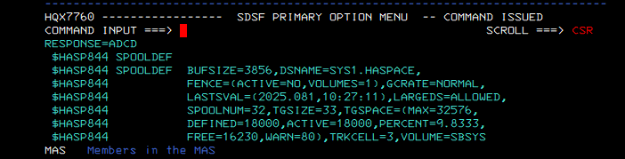

**Observe:** SPOOLDEF now reports 18000 active track groups and about 9.8% usage.

**Interpret:** active capacity increased sixfold relative to the 3000-TG baseline. Existing occupancy is therefore spread across a much larger active spool capacity, explaining the sharp utilization drop.

**Capacity lesson:** a lower percentage here does not mean old spool records disappeared. The denominator changed because available spool capacity increased.

### 12 — persist the emulator topology

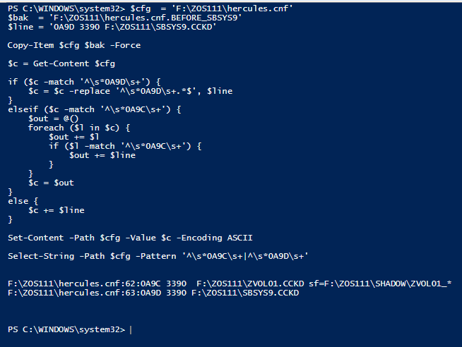

**Observe:** the Hercules configuration is updated so 0A9D maps to SBSYS9.CCKD after restart.

**Interpret:** runtime success and restart persistence are separate engineering concerns. The lab closes both.

## State transition proved by the evidence

    3000 TG / ~58%
          |
    free 0A9D
          |
    create CCKD
          |
    attach 3390
          |
    ICKDSF INIT + VTOC
          |
    online SBSYS9
          |
    allocate SYS1.HASPACE
          |
    JES2 consumes capacity
          |
    18000 TG / ~9.8%
          |
    persist Hercules mapping

## Failure reasoning

If the final capacity had not changed, troubleshoot the chain in order: **device attachment → z/OS online state → volume initialization/VTOC → HASPACE allocation → JES2 recognition**. Do not jump directly to JES2 configuration when an earlier storage layer is unproven.

## Evidence boundary

**VALIDATED:** baseline measurement, emulator DASD creation, device attachment, ICKDSF initialization, VTOC creation, online volume state, spool data-set allocation, final JES2 capacity observation and emulator persistence.

This evidence does not by itself establish enterprise spool sizing policy, multi-member MAS behavior or production availability requirements.

## Knowledge check

1. Why is a CCKD file not yet a z/OS volume?
2. What role does the VTOC play?
3. Why must HASPACE allocation be evidenced separately from bringing SBSYS9 online?
4. Why can spool utilization fall even if existing spool content is unchanged?
5. Which layer would you investigate first if 0A9D never became an online SBSYS9 volume?

---
### Continue learning

**Related:** [JCL/JES2 course](https://github.com/P-dot/JCL_LABS) · [Storage/VSAM](https://github.com/P-dot/vsam01) · [Diagnostics](https://github.com/P-dot/zos-problem-determination-diagnostics)  
**Academy:** [z/OS Engineering Academy](https://github.com/P-dot/P-dot/blob/main/docs/ACADEMY.md)
