# Lab 12 — WLM direct access from the ISPF Primary Option Menu

## Objective

Customize the ISPF Primary Option Menu on a z/OS V1R11 ADCD system so that **Workload Manager (WLM)** can be opened directly from a new `12 WLM` option.

The customization is implemented in a user panel library rather than by changing the IBM/ADCD-supplied panel.

## Environment

- IBM z/OS V1R11 ADCD
- ISPF / TSO
- Workload Manager
- XCF / WLM couple data sets
- Hercules-based lab environment
- User panel override through `USER.ISPPLIB`

## Result

The original navigation path was:

```text
ISPF Primary Option Menu
        |
        +-- M  More
              |
              +-- 12 WLM
                    |
                    +-- Workload Manager
```

The completed lab adds a direct path:

```text
ISPF Primary Option Menu
        |
        +-- 12 WLM
              |
              +-- CMD(%IWMARIN0)
                    |
                    +-- Workload Manager
```

## 1. Validate the existing WLM configuration

Before changing ISPF, WLM was inspected from the operator console.

```text
D WLM
D XCF,COUPLE
D XCF,COUPLE,TYPE=WLM
```

The system already had an active WLM configuration, so no new WLM couple data sets were created.

Observed configuration:

```text
Service definition : ETPWLM
Active policy      : ETPBASE

Primary WLM CDS    : SYS1.ADCDPL.WLM.CDS01
Alternate WLM CDS  : SYS1.ADCDPL.WLM.CDS02
```

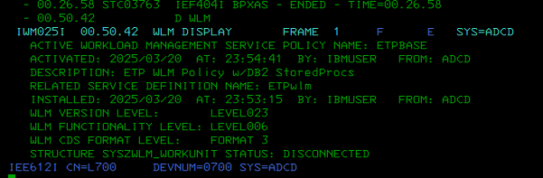

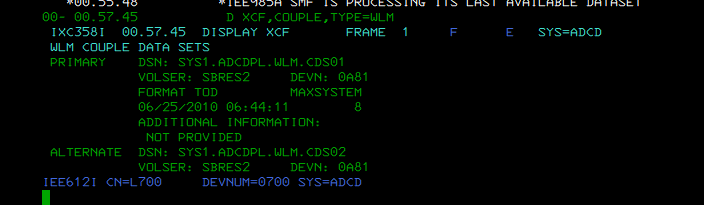

## 2. Inspect the installed WLM service definition

WLM was opened through the existing IBM Products path and the installed definition was extracted from the WLM couple data set.

```text
M
12
```

Then:

```text
2  Extract definition from WLM couple data set
```

The extracted definition was:

```text
Definition name : ETPWLM
Description     : ETP WLM Policies
```

The active service policy was confirmed as:

```text
ETPBASE
```

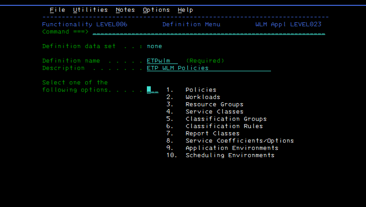

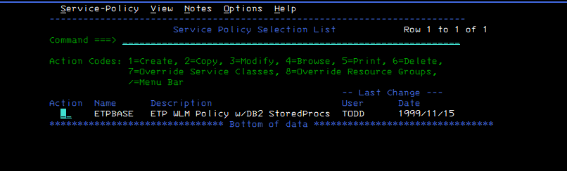

## 3. Identify the active ISPF panel

`PANELID` was enabled to identify the ISPF Primary Option Menu panel.

```text
PANELID
```

The primary panel was:

```text
ISR@PRIM
```

`ISRDDN` was then used to inspect the active `ISPPLIB` concatenation.

```text
TSO ISRDDN
F ISPPLIB
M ISR@PRIM
```

The panel existed in IBM/ADCD libraries, while `USER.ISPPLIB` was the first library in the concatenation.

```text
USER.ISPPLIB
ADCD.Z111S.DBS1.ISPPLIB
ADCD.Z111S.ISPPLIB
ISP.SISPPENU
...
```

This allowed the customization to be implemented as a user override.

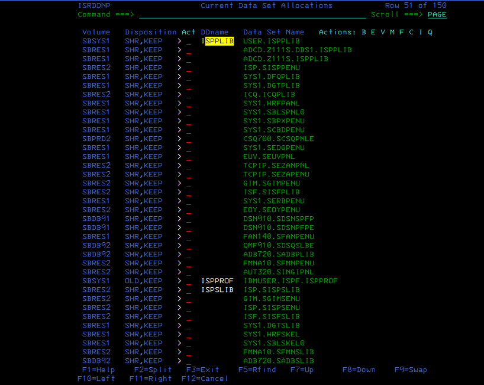

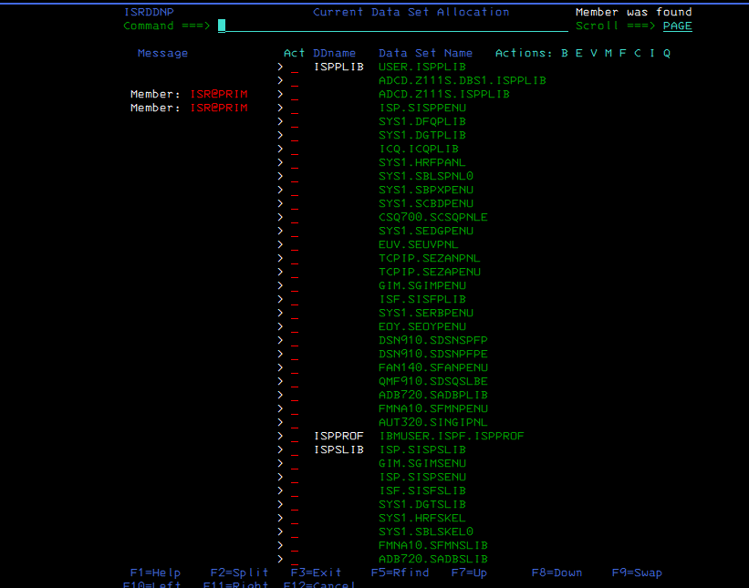

## 4. Preserve the supplied panel

The active supplied member was inspected in browse mode and copied to:

```text
USER.ISPPLIB(ISR@PRIM)
```

The original ADCD/IBM members were left unchanged.

Because `USER.ISPPLIB` is first in `ISPPLIB`, the user copy takes precedence after ISPF is restarted.

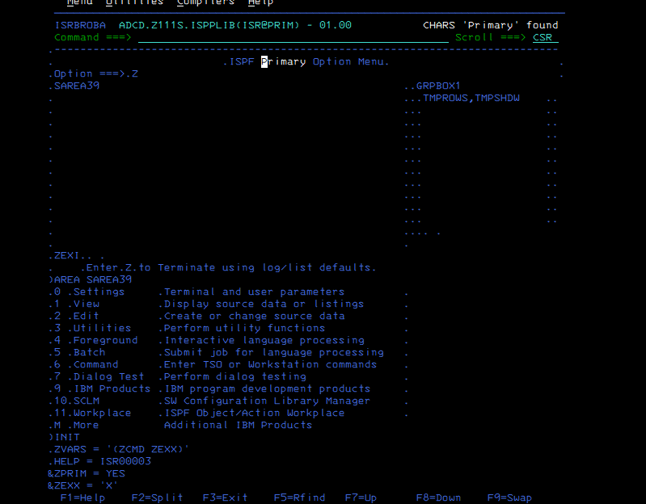

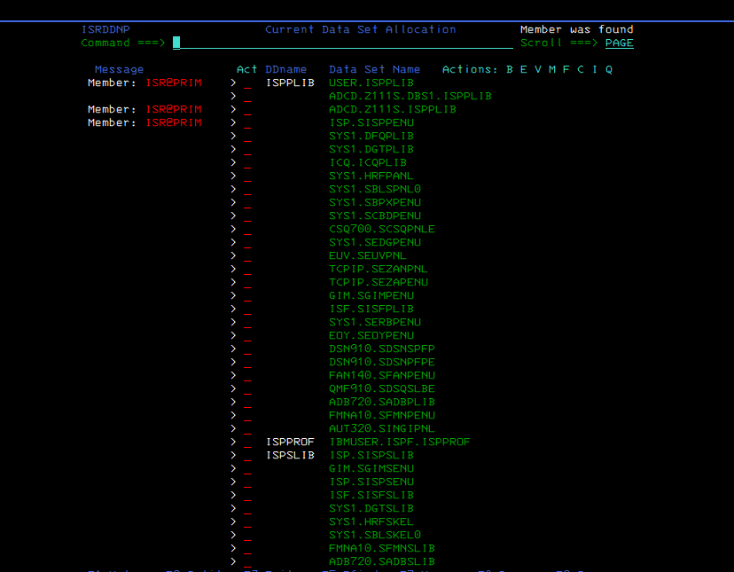

## 5. Add the WLM option to the menu

The display section of `USER.ISPPLIB(ISR@PRIM)` was extended with:

```text
12 WLM              Workload Manager
```

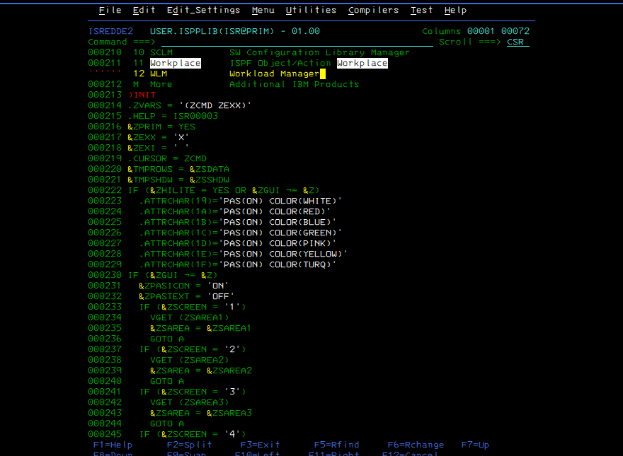

## 6. Reuse the native WLM invocation

The existing IBM Products panel was identified as:

```text
IBMPRODS
```

It was located in:

```text
ADCD.Z111S.DBS1.ISPPLIB(IBMPRODS)
```

Its `)PROC` section showed the native WLM invocation:

```text
12,'CMD(%IWMARIN0)'
```

That exact invocation was added to the `&ZSEL = TRANS(...)` block in the user copy of `ISR@PRIM`.

```text
12,'CMD(%IWMARIN0)'
```

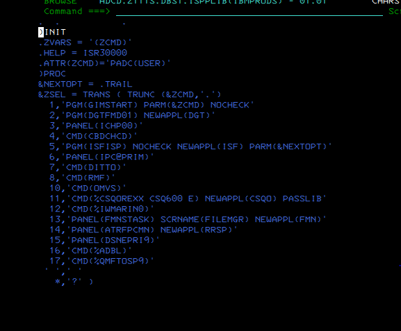

## 7. Troubleshooting

An initial transcription error used the wrong EXEC name and produced:

```text
IKJ56500I COMMAND WMRIN0 NOT FOUND
```

The IBM-supplied `IBMPRODS` panel was rechecked and showed the correct name:

```text
IWMARIN0
```

After correcting the panel entry to:

```text
12,'CMD(%IWMARIN0)'
```

the direct WLM launch succeeded.

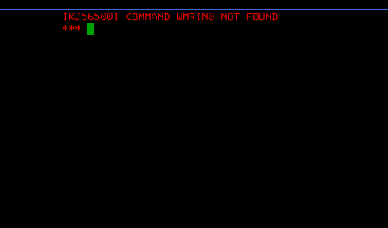

## 8. Verification

After leaving ISPF completely and starting a fresh ISPF session, the Primary Option Menu displayed:

```text
12 WLM              Workload Manager
```

Selecting option `12` opened WLM directly.

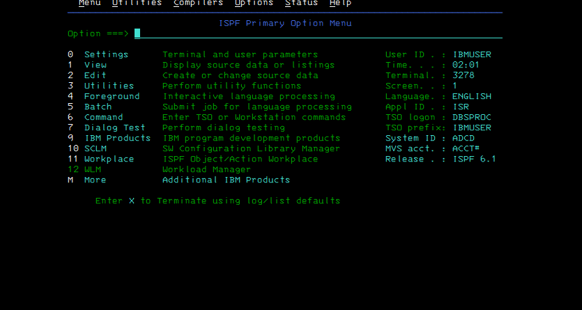

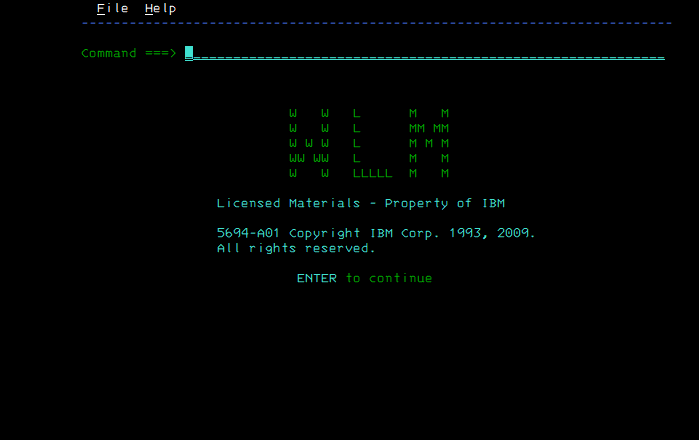

## Engineering notes

- WLM itself was already installed and configured; the lab did **not** recreate the WLM CDS.
- The supplied IBM/ADCD panels were not modified.
- `USER.ISPPLIB` provides a reversible override layer.
- `ISRDDN` was used to determine the actual runtime panel concatenation rather than assuming library names.
- The WLM invocation was copied from the system's own `IBMPRODS` panel instead of inventing a command.
- A new ISPF session was required before the overridden `ISR@PRIM` was displayed.

## Rollback

To remove the customization, rename or delete only the user override:

```text
USER.ISPPLIB(ISR@PRIM)
```

After restarting ISPF, the next `ISR@PRIM` in the `ISPPLIB` concatenation will be used again.

## Evidence

All screenshots captured during the lab are stored under [`evidence/`](evidence/).

The evidence includes WLM/XCF validation, WLM definition inspection, ISRDDN discovery, panel source inspection, user override creation, troubleshooting, and final successful launch.
